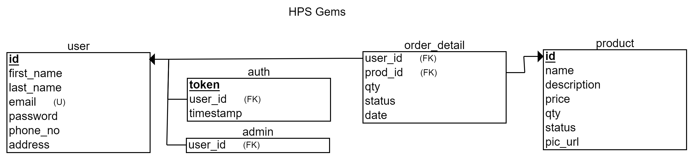

# Welcome, contributors! :wave:

## Local Setup

- Install [XAMPP](https://www.apachefriends.org/download.html), [WAMP](https://wampserver.aviatechno.net/) or a LAMP stack.
- Create a database. (Schema given below.)
- Create a local environment file in the root directory of the project (`.htaccess` for XAMPP) (don't forget to add the file to `.gitignore`) and add the following environment variables to it
  - `SetEnv DB_HOST xxxx`
  - `SetEnv DB_NAME xxxx`
  - `SetEnv DB_USERNAME xxxx`
  - `SetEnv DB_PASSWORD xxxx`
- Run the Apache and MySQL services and access the site at `localhost/<project_folder_name>`. PHPMyAdmin can be accessed at `localhost/phpmyadmin`.

## Schema

## Hosting

#### Heroku Hosting (PHP with MySQL)

- Heroku instructions: https://devcenter.heroku.com/articles/deploying-php
- Add environment variables to the `Config Vars` provided by Heroku.
- ClearDB MySQL Heroku instructions: https://devcenter.heroku.com/articles/cleardb
- Import DB to ClearDB: https://fuzzyblog.io/blog/heroku/2019/10/16/importing-your-local-mysql-database-into-heroku.html
	- Unknown collation error: https://stackoverflow.com/a/42385164/11958552
	- Migration of local DB data to ClearDB is a little cumbersome.

> NOTE:
> - JawsDB can also be used as a MySQL DB add-on in place of ClearDB.
> - Both ClearDB and JawsDB have a free tier in Heroku, but might [require a credit/debit card for account verification](https://devcenter.heroku.com/articles/account-verification#when-is-verification-required).
> - **Free (but unreliable) services for a MySQL DB**
>	- https://db4free.net/
>	- https://cloud.ametnes.com/
>	- https://remotemysql.com/
