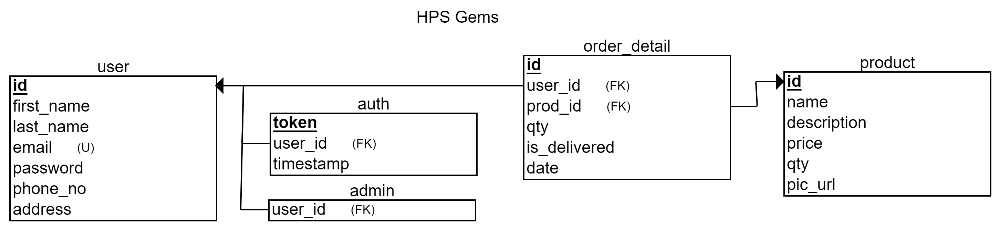

# Welcome, contributors! :wave:

## Technologies Used

Front end: HTML, vanilla CSS and vanilla JS (with Web Components and Fetch API)

Back end: PHP (with PDO) and MySQL

## Local Setup

- [Download XAMPP](https://www.apachefriends.org/download.html). (Other options: [WAMP](https://wampserver.aviatechno.net/) or a LAMP stack.)
- [Install and configure XAMPP.](https://www.youtube.com/watch?v=6tCWiexc05U)
- Create a database (schema given below) or import a dump file of the database that is available at [`server/config/dump_file.sql`](server/config/dump_file.sql). (Import it using phpMyAdmin or MySQL commands.)
- Create a local environment file in the root directory of the project (`.htaccess` for XAMPP) (don't forget to add the file to `.gitignore`) and add the following environment variables to it, replacing `xxxx` with the vaules for your database.
  - `SetEnv DB_HOST xxxx`
  - `SetEnv DB_NAME xxxx`
  - `SetEnv DB_USERNAME xxxx`
  - `SetEnv DB_PASSWORD xxxx`
- Run the Apache and MySQL services and access the site at `localhost/<project_folder_name>`. PHPMyAdmin can be accessed at `localhost/phpmyadmin`.

## Schema

## Hosting

> NOTE: This project is hosted on Heroku from the `deploy` branch with the ClearDB MySQL add-on.

#### Heroku Hosting (PHP with MySQL)

- Heroku instructions: https://devcenter.heroku.com/articles/deploying-php
- Add environment variables to the `Config Vars` provided by Heroku.
- Heroku ClearDB MySQL add-on instructions: https://devcenter.heroku.com/articles/cleardb
- Import your database to a remote database: https://fuzzyblog.io/blog/heroku/2019/10/16/importing-your-local-mysql-database-into-heroku.html
	- Unknown collation error: https://stackoverflow.com/a/42385164/11958552
	- Migration of local database data to a remote database is a little cumbersome.
	- A dump file of the database is available at [`server/config/dump_file.sql`](server/config/dump_file.sql).

> NOTE:
> - JawsDB (MySQL or MariaDB) can also be used as a MySQL database add-on in place of ClearDB.
> - Both ClearDB and JawsDB have a free tier in Heroku, but might [require a credit/debit card for account verification](https://devcenter.heroku.com/articles/account-verification#when-is-verification-required).
> - **Free (but unreliable) services for a MySQL DB**
>		- https://db4free.net/
>		- https://cloud.ametnes.com/
>		- https://remotemysql.com/
